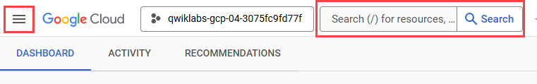
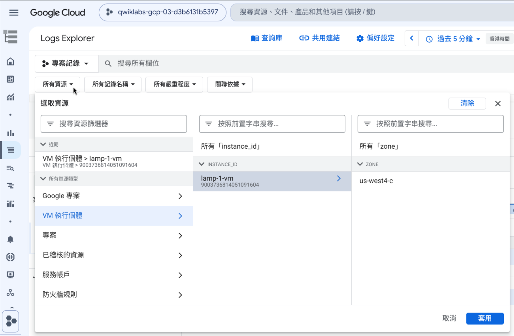

# GSP089：使用 Terraform 完成 [Cloud Monitoring Lab](https://partner.skills.google/focuses/22769?parent=catalog)

本 lab 會使用 Terraform 建立一台 Compute Engine VM，安裝 Apache 與 Google Cloud Ops Agent，並建立 Cloud Monitoring 的 uptime check、alert policy 和 dashboard。

## 這份 README 和 Skills Boost 的關係

Skills Boost 是這個 lab 的入口和判分系統；最後是否完成，以 Skills Boost 的 Check my progress 為準。不過這個 lab 只有 20 分鐘，不建議一打開 README 就啟動 lab。

這份 README 是同一個 lab 的 Terraform 做法。原本 Skills Boost 會帶你在 Console 建立 VM、uptime check、alert policy 和 dashboard；這裡改成用 Terraform 建立對應資源，並說明每個 `.tf` 檔案、Terraform 指令和驗證方式的意義。

> [!IMPORTANT]
> 先不要啟動 Skills Boost lab。這個 lab 只有 20 分鐘，建議先讀到「Terraform 執行流程」，理解 Terraform 會建立哪些資源、每個檔案負責什麼，以及後面指令會做什麼。

建議閱讀和操作順序：

1. 先讀到「Terraform 執行流程」。
2. 準備操作時，再啟動 Skills Boost lab，取得本次 lab 的帳號、專案（project）、區域（region）和可用區（zone）。
3. 回到這份 README，從「啟動 lab 後」開始操作。倒數開始後，先一路做到並完成「對照 lab 任務與驗證」。
4. 每完成一段 Terraform 操作，就回到 Skills Boost 按 Check my progress，確認 lab 系統是否接受目前狀態。
5. 主 lab 完成後再決定是否做 OpenTelemetry 延伸練習；如果要做，先不要執行 `terraform destroy`。

> [!CAUTION]
> 如果 Skills Boost 畫面上的 region、zone、資源名稱或任務內容和 README 不同，請以 Skills Boost 當次 lab 的內容為準，再把對應值填進 `terraform.tfvars` 或 Terraform 變數。

Google Cloud Console 和 Skills Boost 可能顯示中文或英文介面。README 會保留常見英文名稱，必要時補上中文對照；如果你的畫面是中文，請用英文名稱或相近中文名稱對照尋找。

這份 README 的目標不是只讓你把指令貼完，而是讓你看懂：

- Terraform 如何用 `.tf` 檔案描述 Google Cloud 資源
- `terraform init`、`terraform plan`、`terraform apply` 分別做了什麼
- 每個 Terraform 檔案在這個 lab 裡負責哪一段設定
- 要去哪裡查 Terraform 語法和 Google provider 支援的欄位
- 建立完成後，如何在 Google Cloud Console 驗證資源與監控資料

## 建立的資源

Terraform 會建立下列資源：

- Compute Engine VM：`lamp-1-vm`
- HTTP 防火牆規則：允許外部連線到 TCP 80
- Apache HTTP Server
- Google Cloud Ops Agent
- Uptime check：`Lamp Uptime Check`
- Alert policy：`Inbound Traffic Alert`
- Monitoring dashboard：`Cloud Monitoring LAMP Qwik Start Dashboard`
- Dashboard widgets：`CPU Load`、`Received Packets`

## Terraform 如何描述這個 lab

Terraform 是 Infrastructure as Code（IaC）工具。你在 `.tf` 檔案裡宣告「希望雲端環境最後長什麼樣子」，Terraform 會讀取這些宣告，透過 Google provider 呼叫 Google Cloud API 建立或更新資源。

這個 lab 裡會看到幾個重要概念：

- 提供者（provider）：告訴 Terraform 要使用哪個雲端平台或服務。這個專案使用 `hashicorp/google` provider。
- 資源（resource）：要由 Terraform 建立或管理的物件，例如 VM、防火牆規則、uptime check、alert policy。
- 資料來源（data source）：讀取已存在的資源。這個專案會讀取 Google Cloud 預設網路（default network）。
- 變數（variable）：每次 lab 可能不同的輸入值，例如專案 ID、區域（region）、可用區（zone）。
- 輸出值（output）：Terraform 執行後提供給你驗證或後續操作使用的值，例如 Apache 網址。
- 狀態檔（state）：Terraform 用來記錄「哪些雲端資源是由目前這份設定管理」的資料。

你可以先把 Terraform 想成「宣告式設定」：它不是逐步模擬 Console 操作，而是把目標狀態寫在檔案裡，再由 Terraform 計算要新增、修改或刪除哪些資源。

## 先讀懂這個專案

在執行 Terraform 前，先知道每個檔案負責什麼，後面看到 plan 和 apply 時會比較容易理解。

- [`versions.tf`](versions.tf)：設定 Terraform 版本需求，以及 Google provider 的來源與版本。
- [`provider.tf`](provider.tf)：設定 Google provider 使用的專案、區域、可用區。
- [`.terraform.lock.hcl`](.terraform.lock.hcl)：記錄本專案目前鎖定的 provider 版本與校驗資訊。這讓同一份 lab 設定在不同時間或不同 Cloud Shell 中執行時，盡量使用一致的 Google provider。
- [`variables.tf`](variables.tf)：定義輸入變數，例如 `project_id`、`region`、`zone`、`vm_name`、`machine_type`、`alert_email`。
- [`terraform.tfvars.example`](terraform.tfvars.example)：安全的變數檔範例。實際 lab 會產生自己的 `terraform.tfvars`。
- [`main.tf`](main.tf)：建立 VM、防火牆規則，並用 startup script 安裝 Apache、PHP、Google Cloud Ops Agent。
- [`monitoring.tf`](monitoring.tf)：建立 uptime check、email notification channel、alert policy、Monitoring dashboard。
- [`outputs.tf`](outputs.tf)：輸出專案 ID、VM 名稱、外部 IP、Apache URL、監控資源名稱。
- [`samples/opentelemetry/`](samples/opentelemetry/)：選做的 OpenTelemetry 延伸練習範例。

建議先打開 `main.tf` 和 `monitoring.tf`，把 resource 名稱和後面 lab 任務對照起來。例如 `google_compute_instance.lamp` 對應 VM，`google_monitoring_uptime_check_config.lamp` 對應 uptime check。

## Terraform 語法與文件怎麼查

README 只會說明這個 lab 需要理解的重點；如果你想知道 `.tf` 語法、resource 支援欄位或 CLI 指令細節，請查官方文件。

- [Terraform Language Documentation](https://developer.hashicorp.com/terraform/language)：查 `.tf` 語法、block、argument、expression、variable、output 等語言規則。
- [Terraform CLI Documentation](https://developer.hashicorp.com/terraform/cli)：查 `init`、`plan`、`apply`、`destroy` 等指令的完整行為和參數。
- [Google provider documentation](https://registry.terraform.io/providers/hashicorp/google/latest/docs)：查 Google Cloud resource 和 data source 支援哪些欄位。

查 Google provider 文件時，可以用 Terraform resource 名稱搜尋。例如：

- `google_compute_instance`：Compute Engine VM 支援的欄位。
- `google_compute_firewall`：防火牆規則支援的欄位。
- `google_monitoring_uptime_check_config`：uptime check 支援的欄位。
- `google_monitoring_alert_policy`：alert policy 條件、門檻、通知設定。
- `google_monitoring_dashboard`：dashboard JSON 設定方式。

Terraform provider 文件通常會標示欄位是 required、optional 或 computed。遇到不確定的欄位時，優先回到 provider 文件確認，而不是只照範例猜。

## Terraform 執行流程

這個 lab 會用到下列 Terraform 指令。

`terraform init` 會初始化目前目錄，下載 `.tf` 檔案中指定的 provider，並準備 Terraform 後續執行所需的本機資料。通常一個新的 Terraform 專案或 provider 設定變更後，都要先執行一次。

`terraform plan` 會讀取 `.tf` 檔案、變數值和目前 state，計算如果套用設定，會新增、修改或刪除哪些資源。這一步還不會真的建立資源，適合先檢查 Terraform 準備做什麼。

`terraform apply` 會顯示即將套用的計畫，確認後才會呼叫 Google Cloud API 建立或更新資源。成功後，Terraform 會更新 state，記錄它管理的資源。

`terraform output` 會讀取 [`outputs.tf`](outputs.tf) 定義的輸出值。例如 Apache URL 是 Terraform 從 VM 外部 IP 組合出來的驗證網址。

`terraform destroy` 會根據 state 刪除 Terraform 管理的資源。確定不再需要 VM、監控設定和 dashboard 時，才使用它清理資源。

讀到這裡，再啟動 Skills Boost lab 會比較穩。倒數開始後，先完成「啟動 lab 後」到「對照 lab 任務與驗證」這幾段。

## 啟動 lab 後

請使用 Google Cloud Skills Boost lab 提供的帳號登入 Google Cloud Console，並開啟 Cloud Shell。

接下來的操作都在 Cloud Shell 裡完成。先確認目前登入帳號與專案是本次 lab 提供的帳號和專案（project）：

```bash
gcloud auth list
gcloud config list project
```

確認 Cloud Shell 裡有 Terraform：

```bash
terraform version
```

如果 Cloud Shell 顯示找不到 `terraform` 指令，請依照 HashiCorp 官方文件的 [Install Terraform](https://developer.hashicorp.com/terraform/install) 說明安裝。安裝完成後，再重新執行 `terraform version` 確認。

把本專案 clone 到 Cloud Shell，並進入專案目錄：

```bash
git clone https://github.com/denny0223/GSP089-Terraform.git
cd GSP089-Terraform
```

後續 `terraform init`、`terraform plan`、`terraform apply` 和清理指令都要在這個目錄中執行。

> [!TIP]
> 如果後面的 Terraform 指令找不到檔案或顯示目前目錄沒有 Terraform 設定，先用 `pwd` 確認自己在 `GSP089-Terraform` 目錄中。

## 設定 lab 環境

每次啟動 Skills Boost lab 時，Google Cloud 專案 ID（project id）不同，region 和 zone 也會不同。先在 Skills Boost 頁面上的「工作 1：建立 Compute Engine 執行個體（Task 1. Create a Compute Engine instance）」段落找到本次 lab 指定的區域（region）與可用區（zone），並設定成 shell 變數：

```bash
REGION="請把這整段文字改成本次 lab 指定的 region，例如 us-central1"
ZONE="請把這整段文字改成本次 lab 指定的 zone，例如 us-central1-b"

gcloud config set compute/region "${REGION}"
gcloud config set compute/zone "${ZONE}"
```

接著用剛才設定的變數產生本次 lab 專用的 `terraform.tfvars`。Terraform 會從這個檔案讀取專案、region、zone 和 VM 設定：

```bash
PROJECT_ID="$(gcloud config get-value project)"

cat > terraform.tfvars <<EOF
project_id   = "${PROJECT_ID}"
region       = "${REGION}"
zone         = "${ZONE}"
vm_name      = "lamp-1-vm"
machine_type = "e2-medium"
alert_email  = ""
EOF
```

如果要讓 alert policy 寄送 email，把 `terraform.tfvars` 裡的 `alert_email` 改成你的 email：

```hcl
alert_email = "you@example.com"
```

啟用需要的 Google Cloud API：

```bash
gcloud services enable \
  compute.googleapis.com \
  monitoring.googleapis.com \
  logging.googleapis.com
```

這些 API 是 Terraform 建立 Compute Engine、Cloud Monitoring 和 Cloud Logging 相關資源時會用到的服務。

## 執行 Terraform

初始化 Terraform 工作目錄並下載 Google provider：

```bash
terraform init
```

你應該會看到 Terraform 初始化成功，並顯示 provider 已安裝。這一步會在本機建立 `.terraform/` 等執行所需資料；這些資料不需要提交到版本控制。

這個專案已經包含 `.terraform.lock.hcl`，所以 `terraform init` 會依照鎖定檔選擇 provider 版本。只有 `.terraform/` 目錄、state 檔案和本次 lab 專用的 `terraform.tfvars` 不需要提交。

查看 Terraform 準備建立的資源：

```bash
terraform plan
```

> [!NOTE]
> 請先看 plan 裡的摘要。這個 lab 預期會建立 VM、防火牆規則、uptime check、alert policy、可能的 email notification channel，以及 dashboard。`plan` 還不會真正建立資源。

建立資源：

```bash
terraform apply
```

Terraform 會再次列出即將建立的資源。確認內容符合本 lab 後輸入 `yes`。這一步才會真的呼叫 Google Cloud API 建立資源，並更新 Terraform state。

建立完成後，取得 Apache 網址：

```bash
terraform output apache_url
```

用瀏覽器開啟輸出的網址。如果看到 Apache 預設頁面，代表 VM、Apache 和 HTTP 防火牆已正常運作。

## 對照 lab 任務與驗證

### 工作 1：建立 Compute Engine VM

Terraform 會建立 `lamp-1-vm`：

- Machine type：`e2-medium`
- Boot disk：Debian 12
- Network：default network
- External IP：ephemeral external IP
- Network tag：`http-server`

這些設定主要來自 [`main.tf`](main.tf) 裡的 `google_compute_instance.lamp`。HTTP 防火牆規則也會一併建立，對應在 Console 建立 VM 時的「允許 HTTP 流量」。

### 工作 2：安裝 Apache 與 Ops Agent

VM 建立後會執行 [`main.tf`](main.tf) 裡的 startup script，自動完成：

- 更新 apt 套件清單
- 安裝 `apache2` 與 `php`
- 啟用並重啟 Apache
- 安裝 Google Cloud Ops Agent

查看 startup script 記錄：

```bash
gcloud compute ssh lamp-1-vm \
  --zone "$(gcloud config get-value compute/zone)" \
  --command "sudo tail -n 80 /var/log/gsp089-startup.log"
```

確認 Apache 狀態：

```bash
gcloud compute ssh lamp-1-vm \
  --zone "$(gcloud config get-value compute/zone)" \
  --command "sudo systemctl status apache2 --no-pager"
```

確認 Ops Agent 狀態：

```bash
gcloud compute ssh lamp-1-vm \
  --zone "$(gcloud config get-value compute/zone)" \
  --command 'sudo systemctl status "google-cloud-ops-agent*"'
```

### 工作 3：建立 uptime check

Terraform 會建立 `Lamp Uptime Check`，每 60 秒用 HTTP 檢查 VM 外部 IP。這個設定來自 [`monitoring.tf`](monitoring.tf) 裡的 `google_monitoring_uptime_check_config.lamp`。

> [!TIP]
> 要快速找到 Google Cloud 產品和服務，請點選「導覽選單」，或在「搜尋」欄位輸入服務或產品名稱。
> 


到 Console 查看結果：

```text
導覽選單（Navigation menu）> 監控（Monitoring）> 運作時間檢查（Uptime checks）
```

> [!NOTE]
> Uptime check 建立後通常需要等待幾分鐘，狀態才會完整顯示。

### 工作 4：建立 alert policy

Terraform 會建立 `Inbound Traffic Alert`，監控 Ops Agent 的網路流量指標：

```text
agent.googleapis.com/interface/traffic
```

門檻值為大於 `500`，重新測試週期為 `60s`。這個設定來自 [`monitoring.tf`](monitoring.tf) 裡的 `google_monitoring_alert_policy.inbound_traffic`。

如果 `alert_email` 有設定 email，Terraform 也會建立 email notification channel 並掛到 alert policy。

### 工作 5：建立 dashboard 與圖表

Terraform 會建立 dashboard：

```text
Cloud Monitoring LAMP Qwik Start Dashboard
```

Dashboard 內有兩張 line chart：

- `CPU Load`：CPU 1 分鐘負載
- `Received Packets`：收到的網路封包數

到 Console 查看 dashboard：

```text
導覽選單（Navigation menu）> 監控（Monitoring）> 資訊主頁（Dashboards）
```

> [!NOTE]
> Ops Agent 指標剛開始可能不會立刻出現，請等待幾分鐘後重新整理頁面。

### 工作 6：查看 logs

到記錄檔探索工具（Logs Explorer）查看 VM logs：

```text
導覽選單（Navigation menu）> 監控（Monitoring）> Logs Explorer
```

選擇資源：

```text
VM 執行個體（VM instance）> lamp-1-vm
```



也可以用 Cloud Shell 查最近的 VM logs：

```bash
gcloud logging read \
  'resource.type="gce_instance" AND resource.labels.instance_id!=""' \
  --limit=20 \
  --format="table(timestamp,logName.basename(),textPayload)"
```

### 工作 7：觀察 VM 停止與啟動

停止 VM：

```bash
gcloud compute instances stop lamp-1-vm --zone "$(gcloud config get-value compute/zone)"
```

啟動 VM：

```bash
gcloud compute instances start lamp-1-vm --zone "$(gcloud config get-value compute/zone)"
```

VM 停止與啟動後，回到監控（Monitoring）和記錄（Logging）觀察：

- Uptime check 狀態變化
- Logs Explorer 裡的 VM 事件
- 警告（Alerting）頁面的 incident 或 activity

到這裡，主 lab 需要的資源和驗證都已完成。請回到 Skills Boost 按 Check my progress。

如果只做 Skills Boost lab，可以跳到[清理資源](#清理資源)。

> [!IMPORTANT]
> 如果想繼續做 OpenTelemetry 延伸練習，請先保留 VM 和監控資源，不要執行 `terraform destroy`。

## 延伸：用 OpenTelemetry 產生應用程式遙測資料

前面的 lab 主要觀察 VM、Apache、Ops Agent 和網路流量。這些資料大多來自基礎設施或作業系統。

OpenTelemetry 則是讓應用程式自己產生遙測資料的標準。常見資料包含：

- Traces：一次請求經過哪些步驟、花了多少時間
- Metrics：應用程式自訂的計數、延遲、佇列長度等數值
- Logs：應用程式事件與錯誤訊息

在這個延伸練習中，會執行一個 Python 範例程式 [`otel_demo.py`](samples/opentelemetry/otel_demo.py)，產生 traces 和 metrics。接著使用 VM 上的 Ops Agent OTLP receiver 收資料，送到 Cloud Monitoring 和 Cloud Trace。這次操作不示範 OpenTelemetry logs。

這是選做延伸練習，不影響 Skills Boost 的 Check my progress。它的目標是讓你看到 OpenTelemetry 如何回答應用程式問題：

- 哪個路徑請求最多？
- 哪個路徑比較慢？
- 錯誤集中在哪個情境？
- 一次慢請求裡，時間花在哪個子步驟？

範例程式會重複產生下列教學情境：

| 情境 | Route | Status | 預期觀察 |
| --- | --- | --- | --- |
| `fast-homepage` | `/` | `200` | 首頁很快，通常是最低延遲 |
| `healthy-status-api` | `/api/status` | `200` | API 有後端檢查步驟，延遲中等 |
| `slow-checkout` | `/checkout` | `200` | 結帳流程比較慢，trace 會看到 inventory/payment 相關子步驟 |
| `checkout-inventory-error` | `/checkout` | `500` | 結帳偶爾失敗，錯誤會標在 trace 和 error metric 上 |

相關文件：

- [OpenTelemetry Python](https://opentelemetry.io/docs/languages/python/)
- [Collect OpenTelemetry Protocol metrics and traces with the Ops Agent](https://cloud.google.com/monitoring/agent/ops-agent/otlp)

### 步驟 1：先在 Cloud Shell 看 console exporter

先在 Cloud Shell 執行範例，觀察 OpenTelemetry 產生的資料長什麼樣子：

```bash
cd samples/opentelemetry
uv sync
uv run python otel_demo.py --exporter console --iterations 3
cd ../..
```

你會看到程式輸出 span 和 metric。這些資料還沒有送到 Google Cloud，只是印在 Cloud Shell 裡。

span 可以先理解成「一次請求中的一段工作」。例如整個 HTTP request 是一個主要 span，裡面的查詢庫存、準備付款、產生回應頁面，會各自是子 span。多個有父子關係的 span 組合起來，就是一筆 trace。

觀察重點：

- `service.name` 是 `gsp089-otel-demo`
- `handle_request` 是主要 span，代表一整次請求
- `load_config`、`query_health_backend`、`query_inventory`、`prepare_payment`、`render_response` 等是子 span，代表請求中的某個步驟
- `gsp089.demo.requests` 是請求數 counter
- `gsp089.demo.latency` 是延遲 histogram
- `gsp089.demo.errors` 是錯誤數 counter
- span 和 metric 都有 `route`、`status_code`、`scenario` 等屬性，方便分組觀察

### 步驟 2：啟用 Cloud Trace API

Ops Agent 會把 metrics 送到 Cloud Monitoring，把 traces 送到 Cloud Trace。啟用 Cloud Trace API：

```bash
gcloud services enable cloudtrace.googleapis.com
```

### 步驟 3：設定 Ops Agent 接收 OTLP

把範例設定檔 [`ops-agent-otlp-config.yaml`](samples/opentelemetry/ops-agent-otlp-config.yaml) 複製到 VM：

```bash
gcloud compute scp \
  samples/opentelemetry/ops-agent-otlp-config.yaml \
  lamp-1-vm:/tmp/ops-agent-otlp-config.yaml \
  --zone "$(gcloud config get-value compute/zone)"
```

套用 Ops Agent 設定並重啟 agent：

```bash
gcloud compute ssh lamp-1-vm \
  --zone "$(gcloud config get-value compute/zone)" \
  --command "sudo cp /etc/google-cloud-ops-agent/config.yaml /tmp/google-cloud-ops-agent-config.yaml.backup 2>/dev/null || true; sudo cp /tmp/ops-agent-otlp-config.yaml /etc/google-cloud-ops-agent/config.yaml; sudo systemctl restart google-cloud-ops-agent; sudo systemctl status 'google-cloud-ops-agent*' --no-pager"
```

這個設定會讓 Ops Agent 在 VM 上接收 OTLP gRPC 資料。預設 endpoint 是：

```text
localhost:4317
```

### 步驟 4：把範例程式複製到 VM

先確認 VM 上有 `uv`：

```bash
gcloud compute ssh lamp-1-vm \
  --zone "$(gcloud config get-value compute/zone)" \
  --command 'command -v uv >/dev/null || curl -LsSf https://astral.sh/uv/install.sh | sh'
```

接著建立範例目錄，並複製 [`otel_demo.py`](samples/opentelemetry/otel_demo.py)、[`pyproject.toml`](samples/opentelemetry/pyproject.toml) 和 [`uv.lock`](samples/opentelemetry/uv.lock)：

```bash
gcloud compute ssh lamp-1-vm \
  --zone "$(gcloud config get-value compute/zone)" \
  --command "mkdir -p ~/otel-demo"

gcloud compute scp \
  samples/opentelemetry/otel_demo.py \
  samples/opentelemetry/pyproject.toml \
  samples/opentelemetry/uv.lock \
  lamp-1-vm:~/otel-demo/ \
  --zone "$(gcloud config get-value compute/zone)"
```

### 步驟 5：在 VM 上執行範例程式

```bash
gcloud compute ssh lamp-1-vm \
  --zone "$(gcloud config get-value compute/zone)" \
  --command 'cd ~/otel-demo && UV_BIN="$(command -v uv || echo ~/.local/bin/uv)" && "$UV_BIN" run python otel_demo.py --exporter otlp --endpoint localhost:4317 --iterations 10'
```

這次程式不會只把資料印在畫面上，而是會透過 OTLP 送到 VM 上的 Ops Agent。

### 步驟 6：在 Cloud Monitoring 查看自訂 metrics

等待 1 到 3 分鐘後，到 Console：

```text
導覽選單（Navigation menu）> 監控（Monitoring）> Metrics Explorer
```

在 Metrics Explorer 裡點右上角的 `PromQL`，切換到 PromQL 查詢模式。

查詢各 route 和 status 的請求數：

```promql
sum by (route, status_code) (
  workload_googleapis_com:gsp089_demo_requests{monitored_resource="gce_instance"}
)
```

你應該會看到 `/`、`/api/status`、`/checkout` 都有 `200` 請求，且 `/checkout` 也會有少量 `500` 請求。

查詢各 route 的平均延遲：

```promql
sum by (route) (
  workload_googleapis_com:gsp089_demo_latency_sum{monitored_resource="gce_instance"}
)
/
sum by (route) (
  workload_googleapis_com:gsp089_demo_latency_count{monitored_resource="gce_instance"}
)
```

你應該會看到 `/checkout` 的平均延遲最高，`/api/status` 次之，`/` 最低。

查詢錯誤數：

```promql
sum by (route, status_code) (
  workload_googleapis_com:gsp089_demo_errors{monitored_resource="gce_instance"}
)
```

你應該會看到錯誤集中在 `/checkout`，status 是 `500`。

Ops Agent 的 OTLP receiver 會把這些 metrics 寫到 `gce_instance` monitored resource。PromQL 裡的 metric 名稱會把 `workload.googleapis.com/gsp089.demo.requests` 轉成 `workload_googleapis_com:gsp089_demo_requests`；`gsp089.demo.latency` 是 histogram，所以用 `_count`、`_sum`、`_bucket` 後綴查詢。

也可以用 Cloud Shell 呼叫 Cloud Monitoring API，確認 metric descriptor 是否已建立：

```bash
PROJECT_ID="$(gcloud config get-value project)"

curl -s -G \
  -H "Authorization: Bearer $(gcloud auth print-access-token)" \
  "https://monitoring.googleapis.com/v3/projects/${PROJECT_ID}/metricDescriptors" \
  --data-urlencode 'filter=metric.type = starts_with("workload.googleapis.com/gsp089.demo")' \
  | python3 -m json.tool
```

### 步驟 7：在 Cloud Trace 查看 traces

到 Console：

```text
導覽選單（Navigation menu）> 監控（Monitoring）> Trace 探索工具（Trace Explorer）
```

搜尋或篩選 service：

```text
gsp089-otel-demo
```

點進任一 trace，可以看到 `handle_request` 和子 span 的父子關係，以及每個 span 的耗時。這個畫面可以理解成一張請求時間線：越長的 span，代表那段工作花越久。

在這個範例裡，route 和 status 是記在主要 span `handle_request` 的 attributes 上。要找特定路徑的 trace，可以在 Trace Explorer 使用 Filter bar：

1. 點 `Add filter`。
2. 選 `Add attribute filter`。
3. Key 輸入 `http.route`。
4. Value 輸入 `/`、`/api/status` 或 `/checkout`。
5. 如果要找錯誤 trace，再加一個 attribute filter：Key 輸入 `http.response.status_code`，Value 輸入 `500`。

打開篩選後的 trace，再點選 `handle_request` 或下面的子 span。`handle_request` 會顯示 route、status、scenario；子 span 則用來看這次請求裡哪個步驟花最多時間或發生錯誤。

建議依序觀察：

1. 找一筆 `/` 的 trace。它通常只有 `load_config` 和 `render_response`，總耗時較短。
2. 找一筆 `/api/status` 的 trace。它會多出 `query_health_backend`，總耗時比首頁高。
3. 找一筆 `/checkout` 且 status `200` 的 trace。它會包含 `load_user`、`query_inventory`、`prepare_payment`、`render_response`，其中 `query_inventory` 通常耗時最多。
4. 找一筆 `/checkout` 且 status `500` 的 trace。`handle_request` 和 `query_inventory` 會標示錯誤，並記錄 `inventory_timeout` 例外。

這裡要理解的是：metrics 適合先回答「整體趨勢是什麼」，例如哪個 route 慢、哪個 route 錯最多；traces 適合接著回答「單次請求為什麼慢或為什麼錯」，例如慢在 `query_inventory`，或錯在 `inventory_timeout`。

### 這個延伸練習要理解的重點

- Ops Agent 負責收集 VM 系統層級資料，也可以接收應用程式送出的 OTLP 資料。
- OpenTelemetry 讓應用程式用標準格式描述 traces 和 metrics，不需要在程式裡直接呼叫 Cloud Monitoring API 或 Cloud Trace API。
- Terraform 建立的是基礎設施；OpenTelemetry 補上的是應用程式行為的可觀測性。
- 後續可以把自訂 metric 放進 dashboard，或針對應用程式延遲建立 alert policy。

## 清理資源

> [!CAUTION]
> 確定不做 OpenTelemetry 延伸練習，或延伸練習已經做完後，再刪除 Terraform 建立的資源。

```bash
terraform destroy
```

Terraform 會列出即將刪除的資源。確認內容後輸入 `yes`。這會根據 Terraform state 刪除目前專案裡由這份設定管理的 lab 資源。

如果有設定 `alert_email`，清理資源後也可以避免 lab 資源尚未回收期間繼續寄送通知。

## 常見問題

### `terraform apply` 套用到錯誤 project

確認目前 gcloud project 和 `terraform.tfvars`：

```bash
gcloud config list project
cat terraform.tfvars
```

`project_id` 必須是本次 lab 提供的 Google Cloud 專案。

### Apache URL 打不開

startup script 需要時間安裝套件。先等待 1 到 3 分鐘，再檢查：

```bash
terraform output apache_url
gcloud compute ssh lamp-1-vm \
  --zone "$(gcloud config get-value compute/zone)" \
  --command "sudo systemctl status apache2 --no-pager"
gcloud compute ssh lamp-1-vm \
  --zone "$(gcloud config get-value compute/zone)" \
  --command "sudo tail -n 80 /var/log/gsp089-startup.log"
```

### Monitoring 圖表沒有資料

Ops Agent 指標需要幾分鐘才會送到 Cloud Monitoring。確認 agent 狀態：

```bash
gcloud compute ssh lamp-1-vm \
  --zone "$(gcloud config get-value compute/zone)" \
  --command 'sudo systemctl status "google-cloud-ops-agent*"'
```

### VM 建立失敗：zone 沒有足夠資源

如果 `terraform apply` 顯示類似訊息：

```text
The zone ... does not have enough resources available to fulfill the request.
A e2-medium VM instance is currently unavailable ...
```

代表 lab 指定的 zone 暫時沒有足夠容量建立 VM。

> [!WARNING]
> 不要任意改 region、zone 或 machine type，否則可能導致 Skills Boost 的 Check my progress 無法通過。

這是 Compute Engine 的資源可用性錯誤。可參考 Google Cloud 官方文件：[排解資源可用性錯誤](https://cloud.google.com/compute/docs/troubleshooting/troubleshooting-resource-availability?hl=zh-tw)。

先等待幾分鐘，然後在相同設定下再次執行：

```bash
terraform apply
```

如果多次重試仍失敗，請保留 lab 指定的設定，重新啟動 lab 或稍後再試。

## 授權

本專案採用雙授權：

- Terraform、程式碼與範例檔案以 [MIT License](LICENSE) 授權。
- README、教學內容與其他文件以 [Creative Commons Attribution 4.0 International（CC BY 4.0）](LICENSE-docs.md) 授權。
